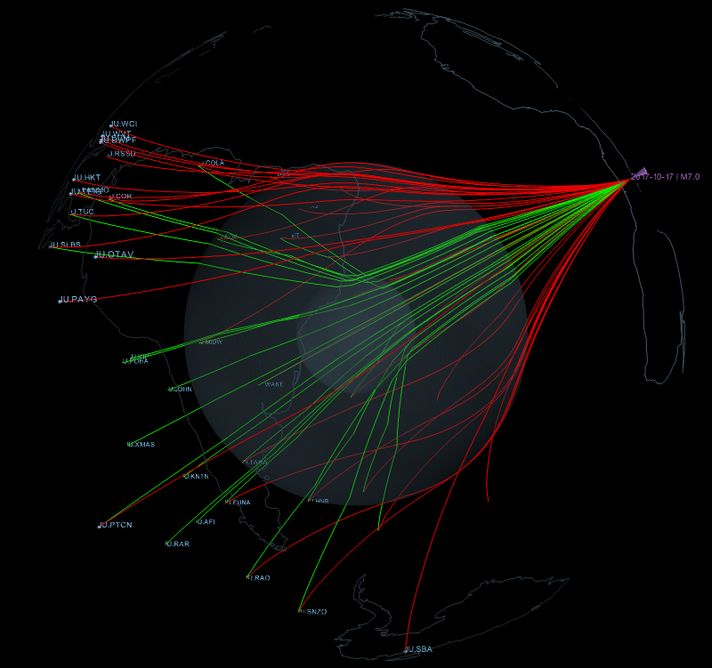
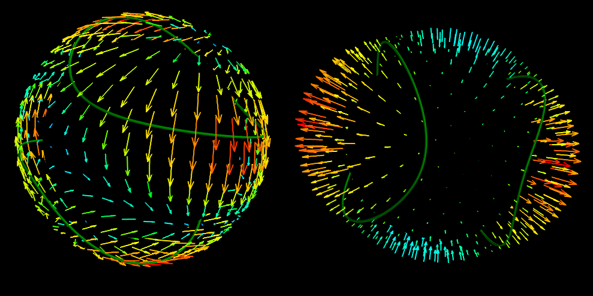

VTK OBSPY
=========


Python toolbox for VTK visualizations of seismology related themes. This
package is based on obspy.


Features
--------

* 3D ray path visualizations
* 3D moment tensor radiation pattern visualization
* vtk file export of ray paths and radiation patterns


Requirements
------------
You need to have obspy (`>1.1.0`) with geographiclib installed. This can be
done with:

```
conda install -c conda_forge obspy
pip install geographiclib
```

Installation
------------
The module just needs to be downloaded, for example with:
```
git clone https://github.com/MMesch/vtkobs.git
```
The plot scripts can be executed directly from the installation directory.
Another option is to install the python routines to the system with
```
pip install .
```
before using the plot scripts type `./plot_rays.py --help` to get some
usage information.

### interactive plotting
For interactive plotting you need to install `mayavi 4.5.0` and make sure that
it works. In anaconda this can be done with:
```
conda install -c menpo mayavi
```
Be careful, you might need to downgrade pyqt to version 4 instead of 5. This
can be done with:
```
conda install pyqt=4
```


## 3D Ray Path Plots
### interactive
this command:

```
./plot_rays.py --inv data/IU_stations.txt --phases Pdiff,PKIKP --evlat 0
               --evlon 20

```
produces this plot:



### VTK files
plotting with the ``--vtkfiles`` option produces vtk files that can be
visualized with paraview.

```
./plot_rays.py --inv data/IU_stations.txt --phases Pdiff,PKIKP --evlat 0
               --evlon 20 --vtkfiles
```

### plot_rays.py command line options
```
$ ./plot_rays.py --help
```

```
usage: ./plot_rays.py --cat catalog.xml --inv inventory.xml
./plot_rays.py --cat catalog.xml --stlat 20 --stlon 30

3D visualization of ray paths. The station and event coordinates have
to be given by the appropriate arguments.

optional arguments:
  -h, --help            show this help message and exit
  --cat CAT             path to catalog file
  --inv INV             path to inventory file
  --evlat EVLAT         event latitude
  --evlon EVLON         event longitude
  --evdep EVDEP         event depth
  --stlat STLAT         station latitude
  --stlon STLON         station longitude
  --phases PHASES       e.g. P,PP
  --noevlabels          switch off event labels
  --nostalabels         switch off station labels
  --vtkfiles            vtk files instead of mayavi
  --colorscheme COLORSCHEME
                        dark or bright
```


## 3D Moment tensor plots
### VTK files
plotting with the ``--vtkfiles`` option produces vtk files that can be
visualized with paraview.
```
./plot_mtensor.py --mt 1,0,0,-1,1,0 --vtkfiles
```

### interactive
this command:

```
./plot_mtensor.py --mt 1,0,0,-1,1,0
```
produces this plot:




### plot_mtensor.py command line options
```
$ ./plot_mtensor.py --help
```

```
usage: ./plot_mtensor.py --mt 1,0,0,1,-1,0

3D visualization of moment tensor radiation patterns.

optional arguments:
  -h, --help  show this help message and exit
  --mt MT     M11,M22,M33,M12,M13,M23
  --vtkfiles  vtk files instead of mayavi
```
